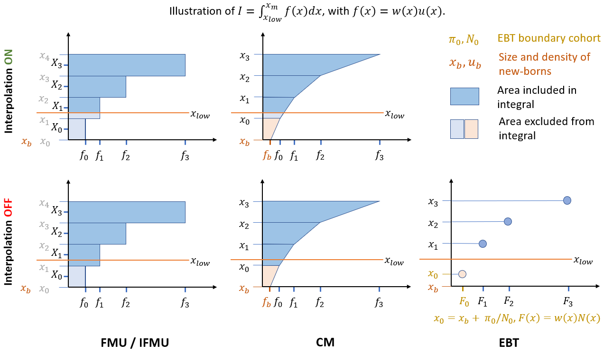

```{r setup, include=FALSE}
knitr::opts_chunk$set(echo = TRUE)
```

## Developer notes for computing the size integral




In libpspm, the computation of this integral depends on the solver method. For different solvers, the integral is defined as follows:

`FMU:` $\quad I = \sum_{i=i_0}^J h_i w_i u_i$

`EBT:` $\quad I = \sum_{i=i_0}^J w_i N_i$, with $x_0 = x_b + \pi_0/N_0$

`CM :` $\quad I = \sum_{i=i_0}^J h_i  (w_{i+1}u_{i+1}+w_i u_i)/2$

where $i_0 = \text{argmax}(x_i \le x_{low})$, $h_i = x_{i+1}-x_i$, and $w_i = w(x_i)$. 

If interpolation is turned on, $h_{i_0}=x_{i_0+1}-x_{low}$, whereas $u(x_{low})$ is set to $u(x_{i_0})$ in FMU and calculated by bilinear interpolation in CM (See Figure). Interpolation does not play a role in EBT.

In the CM method, the density of the boundary cohort is obtained from the boundary condition of the PDE: $u_b=B/g(x_b)$, where $B$ is the input flux of newborns. In the current implementation of the CM method, $B$ must be set to a constant. In future implementations which may allow real-time calculation of $B$, $u_b$ must be calculated recurvisely by solving $u_b = B(u_b)/g(x_b)$, where $B(u_b) = \int_{x_b}^{x_m} f(x)u(x)dx$.